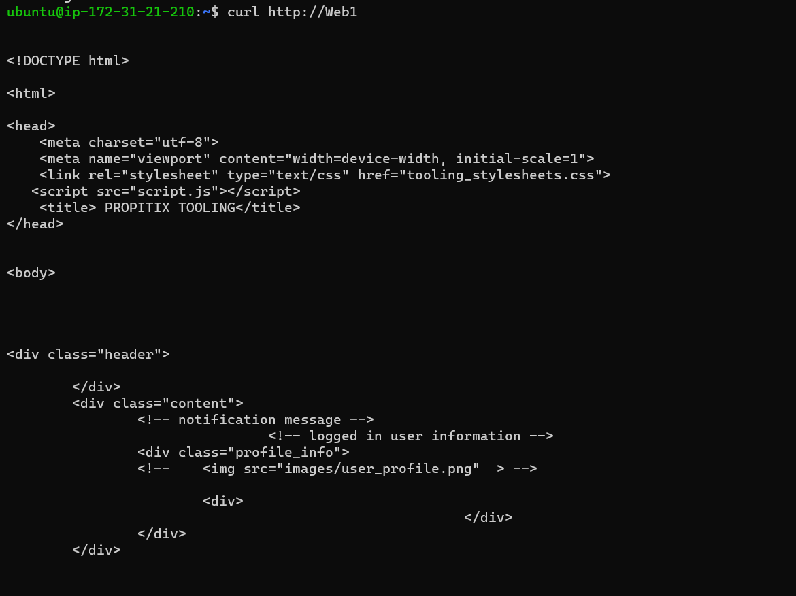

# CONFIGURE APACHE AS A LOAD BALANCER

### Creating an Ubuntu Server 20.04 EC2 instance and naming it Project-8-apache-lb

### Installing Apache Load Balancer on Project-8-apache-lb server and configure it to point traffic coming to LB to both Web Servers

`sudo apt update`

`sudo apt install apache2 -y`

`sudo apt-get install libxml2-dev`

`sudo a2enmod rewrite`

`sudo a2enmod proxy`
	
`sudo a2enmod proxy_balancer`

`sudo a2enmod proxy_http`
        	
`sudo a2enmod headers`

`sudo a2enmod lbmethod_bytraffic`

### Restarting apache2

`sudo systemctl restart apache2` 

### Checking status of apache2

`sudo systemctl status apache2` 

### Configuring load balancing

`sudo vi /etc/apache2/sites-available/000-default.conf`

`<Proxy "balancer://mycluster">
               BalancerMember http://<WebServer1-Private-IP-Address>:80 loadfactor=5 timeout=1
               BalancerMember http://<WebServer2-Private-IP-Address>:80 loadfactor=5 timeout=1
               ProxySet lbmethod=bytraffic
               # ProxySet lbmethod=byrequests
        </Proxy>

        ProxyPreserveHost On
        ProxyPass / balancer://mycluster/
        ProxyPassReverse / balancer://mycluster/`

### Restarting apache server        

`sudo systemctl restart apache2` 

### Trying to access Load Balancer with its public IP address to verify that our configuration works 

[verification](https://3.21.234.27/index.php)

### Comparing logs of webserver1 and webserver2  to show access and examine how traffic is distributed by the Load Balancer

`sudo tail -f /var/log/httpd/access_log`

### Refreshing Load Balancer and comparing access log of wbserver 1 and 2 to examine how traffic is distributed by the Load Balancer as above

[verifying if Load Balancer works with Webserver 1 and 2](https://http://3.21.234.27/index.php)

### Optionally we can use DNS resolution for easy access to our webservers because remembering the ip addresses of our webservers can be cumbersome, to do this we use /etc/hosts file

`sudo vi /etc/hosts`

### Adding 2 records into this file with Local IP address and arbitrary name for both of your Web Servers on our Load Balancer server

`<WebServer1-Private-IP-Address> Web1
<WebServer2-Private-IP-Address> Web2`

### Adding 2 records into this file with Local IP address and arbitrary name for both of your Web Servers

### Update your Load Balancer config file with those names (web1 and web2) instead of IP addresses. Replacing ip addresses of web 1 and 2 with their dns names in Load Balancer config file

`sudo vi /etc/apache2/sites-available/000-default.conf`

`BalancerMember http://Web1:80 loadfactor=5 timeout=1
BalancerMember http://Web2:80 loadfactor=5 timeout=1`

### Trying to curl your Web Servers from Load Balancer locally using names instead of ip addresses

`curl http://Web1`

`curl http://Web2`

                                    